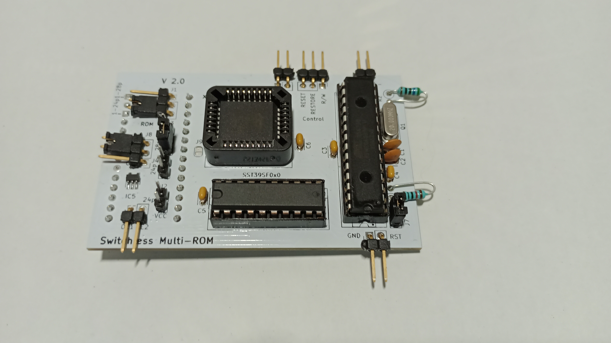
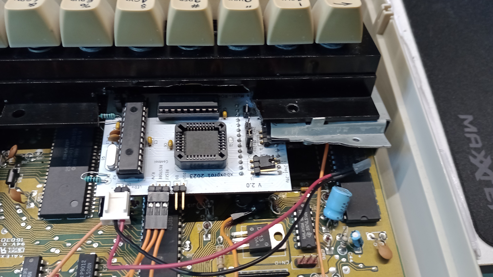

# CBM Switchless Multi-ROM for 2364 & 27128 & 27256 ROMs

This is a fork, rework and combination of two repositories from RetroNynjah.

Here are the pictures of a fully assembled PCB that is installed in a C64C.
The keyboard's plastic frame had to be cut.

Check the Hardware-Info.pdf in the hardware folder for a general technical description and build instructions.
